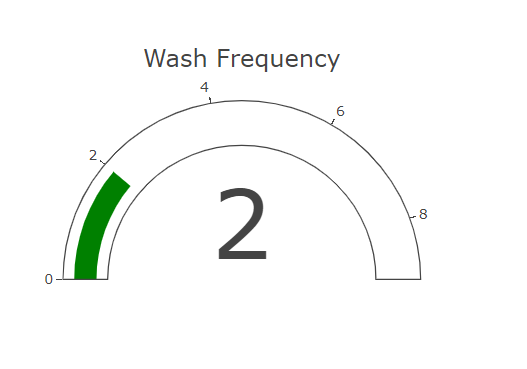

# Plotly-challenge (Belly Button Biodiversity)
Plot.ly Homework - Belly Button Biodiversity

## Methods 

The Belly Button Biodiversity project involved reading and displaying data from a provided json. The data included information of participants and the bacteria they found in their belly buttons.  The following steps were followed to retrieve and display the data:

#### Step 1: Plotly

1. Use the D3 library to read in `samples.json`.

2. Create a dropdown menu to select a different participant. Each time a new participant is selected, update the page with it's data. 

3. Create a bar chart of the top 10 OTU's, .

4. Create a bubble chart that displays each sample.

5. Display the sample metadata in table format.

#### Step 2: Deploy

6.  Create a live website. 

## Results 

The following charts were created from the data: 

### Drop Down Menu 

### Demographic Table data

### Bar Chart 

### Bubble Chart 

## OPTIONAL: Gauge Chart 

To see it live: [Amy Andersson: Belly Button Diversity ](http://robdunnlab.com/projects/belly-button-biodiversity/)